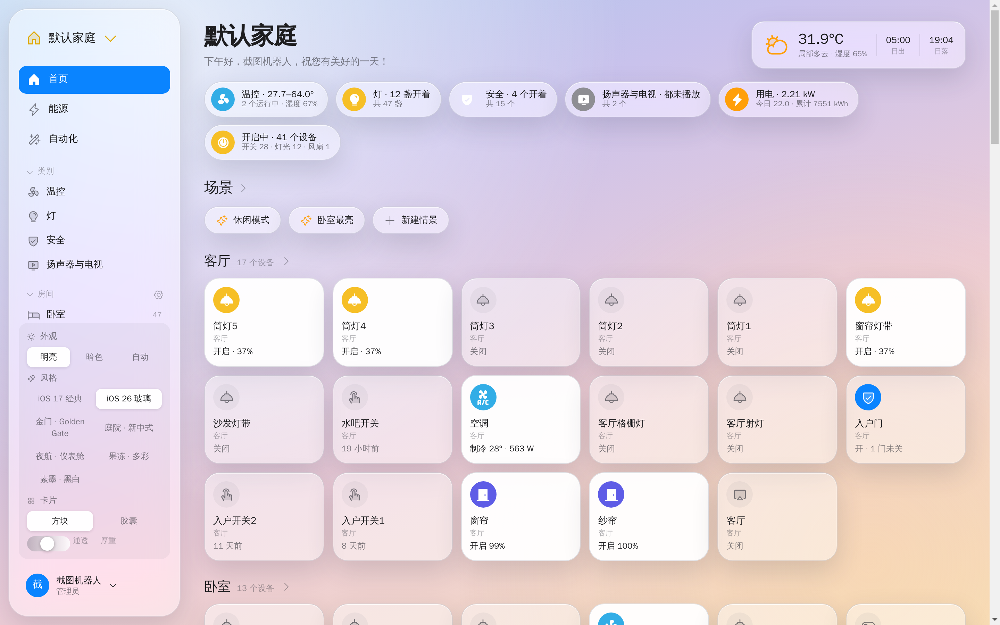
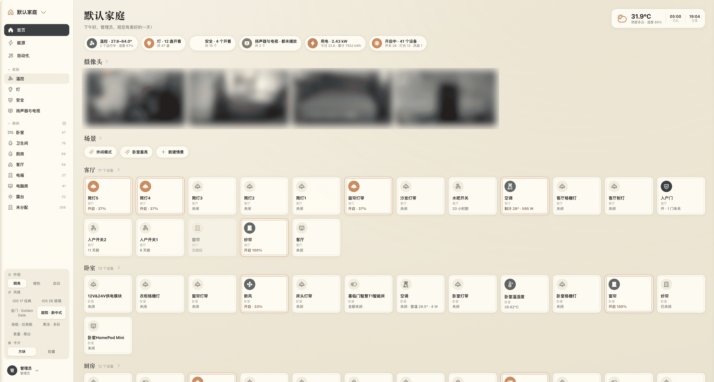
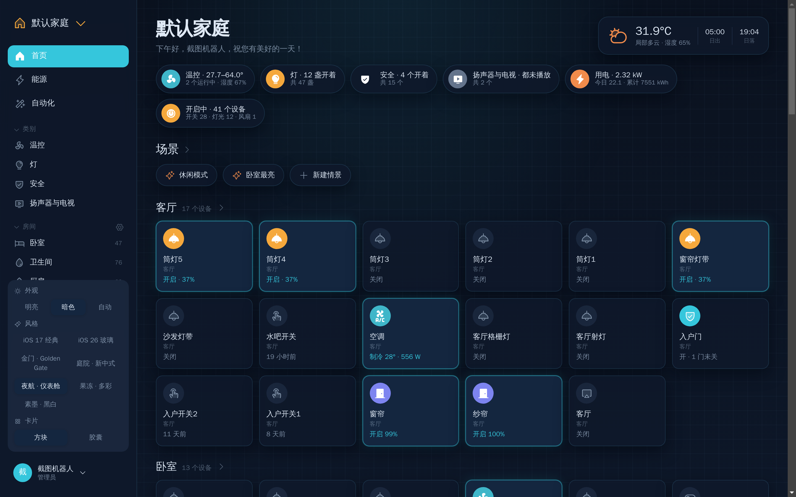
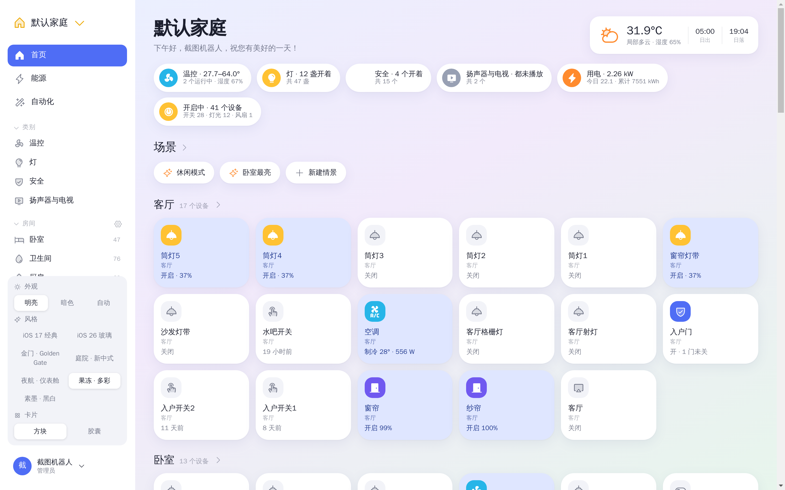
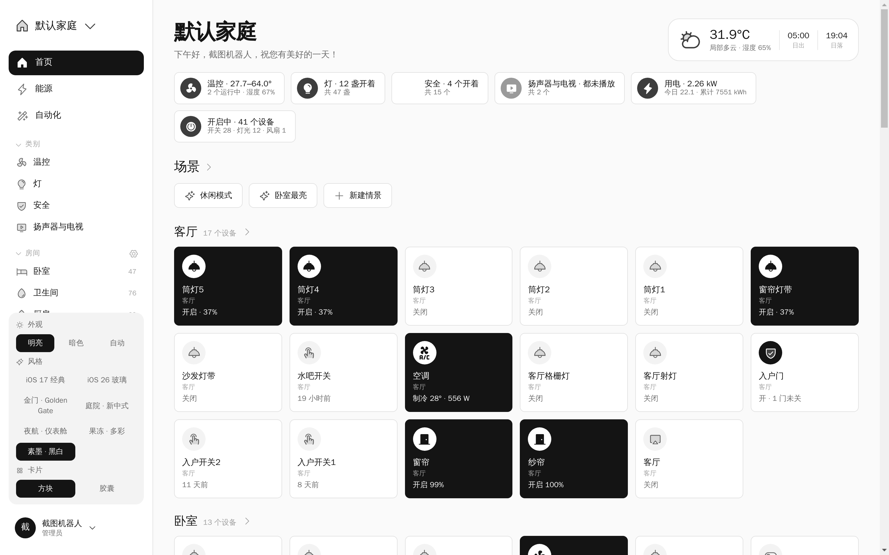
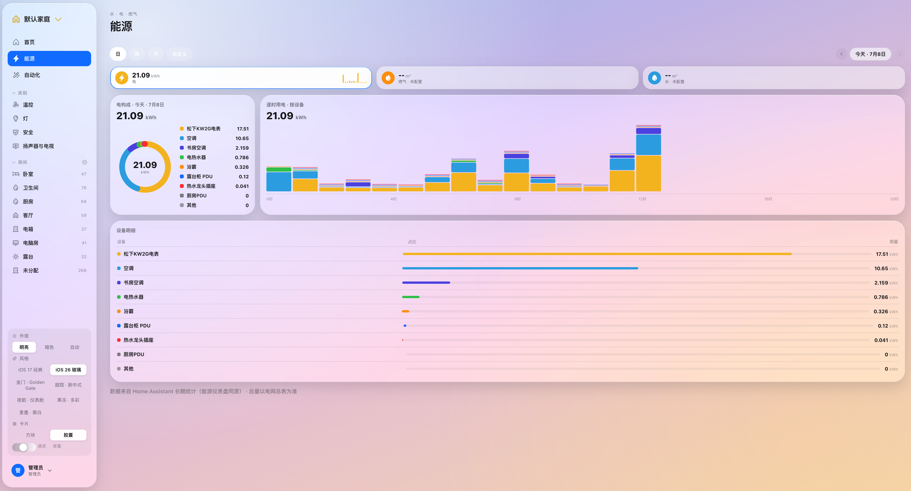
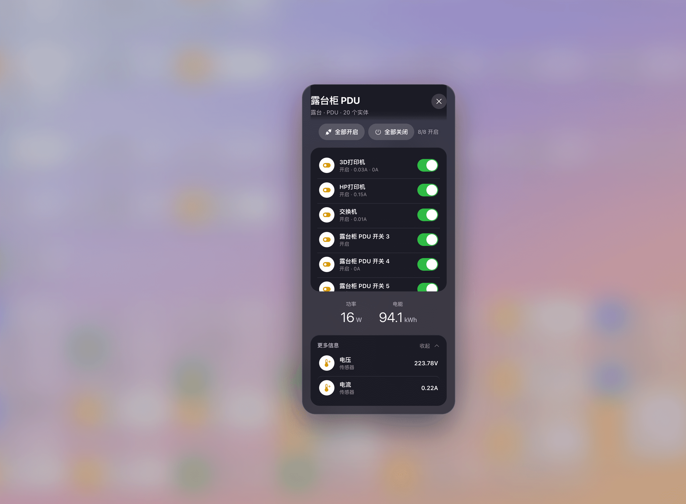
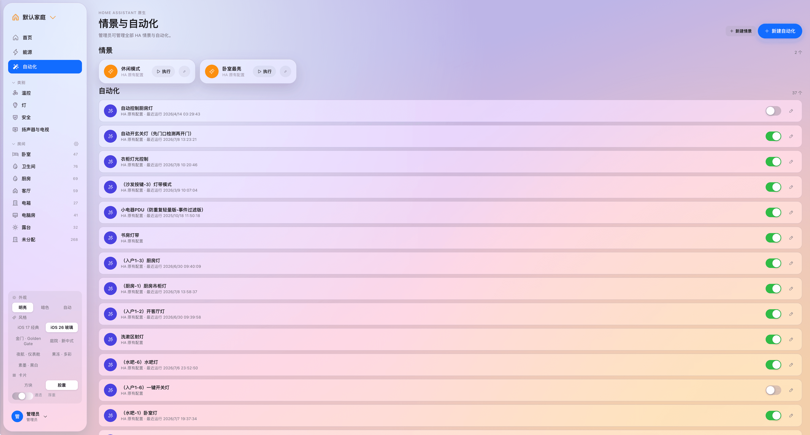
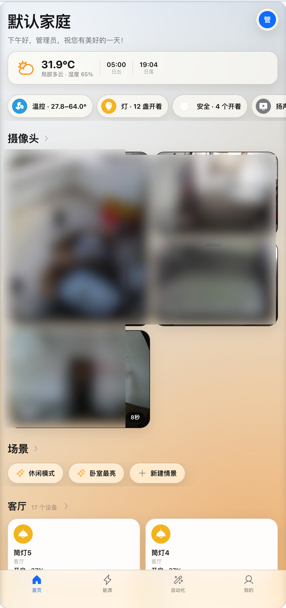

# 同堂 Tongtang

> 「一家同堂」—— 多家庭、多用户、带精细权限的 Home Assistant 家庭控制台。
> HomeKit 风格界面，七套主题，支持跨多个 HA 实例统一管理。

**本仓库为发行仓库**：提供 Docker 镜像部署文件与完整文档，不包含源代码。
本项目不开源，保留所有权利，详见 [LICENSE](LICENSE)。问题反馈与需求建议请提 [Issues](../../issues)。

## 它解决什么问题

Home Assistant 很强，但它的权限模型是"全有或全无"——家里老人孩子一登录就能看到全部几百个实体，还能误删自动化。同堂在 HA 之上加了一层**面向家庭成员的控制台**：

- 管理员按人分配设备，每个人只看到、只能控制被授权的设备
- 界面完全对齐 Apple 家庭 App 的交互习惯，家人零学习成本
- 一套 Web 同时管理多个家庭、多个 HA 实例（自己家 + 父母家），默认一个家庭一个实例、互不混杂

## 快速开始

准备：一台能跑 Docker 的机器（NAS / x86 小主机 / 树莓派，amd64 与 arm64 均支持）+ Home Assistant 长期访问令牌。

**方式一 · 一体化单容器（最简）**

```bash
curl -O https://raw.githubusercontent.com/<你的用户名>/tongtang/main/docker-compose.allinone.yml
docker compose -f docker-compose.allinone.yml up -d
```

**方式二 · 双容器（Nginx 前端 + API 后端）**

```bash
curl -O https://raw.githubusercontent.com/<你的用户名>/tongtang/main/docker-compose.yml
docker compose up -d
```

打开 `http://服务器IP:8080`，按首次配置向导填入 HA 地址与长期访问令牌即可。
详细部署、升级、备份、HTTPS 与故障排查见 [docs/deployment.md](docs/deployment.md)。

镜像仓库：[`jeesa/tongtang`](https://hub.docker.com/r/jeesa/tongtang)（一体化） · [`jeesa/tongtang-web`](https://hub.docker.com/r/jeesa/tongtang-web) + [`jeesa/tongtang-api`](https://hub.docker.com/r/jeesa/tongtang-api)（双容器）

## 界面预览

> 以下截图来自真实家庭环境（约 700 实体规模）。

| 首页 · iOS 26 液态玻璃 | 首页 · 金门 Golden Gate |
|---|---|
|  |  |

| 庭院 · 新中式 | 夜航 · 仪表舱（暗色） |
|---|---|
|  |  |

| 果冻 · 多彩 | 素墨 · 黑白 |
|---|---|
|  |  |

| 能源账本（电/燃气/水 · 表计层级下钻） | 组合设备浮窗（插排端口功率） |
|---|---|
|  |  |

| 情景与自动化 | 管理后台 · 实体管理 |
|---|---|
|  |  |

<p align="center"></p>

## 功能总览

### 控制体验（HomeKit 风格）
- **瓷贴卡片**：点图标即开关（各类型有语义：空调恢复上次模式、扫地机智能切换清扫/回充、影音播放暂停），点卡片/长按打开控制浮窗；方块/胶囊两种卡片样式
- **控制浮窗**：灯光竖向大滑条（亮度/色温/颜色）、空调大温度数字+模式圆钮、热水器水温与运行模式、安防面板布防/撤防、加湿器湿度滑条、窗帘/风扇/水阀开度滑条；风机支持预设模式（换气/干燥/取暖）与摇摆
- **设备自动组合**：同一物理设备的多个实体自动合并为一张卡（PDU 8 口 = 一张"3/8 开启"的组合开关卡），浮窗按类型分区：一键操作 / 开关 / 调节 / 更多信息
- **灯组**：一个设备多盏灯（双模灯/主灯+夜灯+氛围灯）合并为一张卡，浮窗组级调光调色（能力取并集、按各灯实际能力分发），每盏灯可点入单独精调
- **组合卡拆分/合并**（HomeKit「作为单独板块显示」）：组合卡一键拆成独立卡片、随时合并回去，按用户生效
- **「显示为」类型切换**（HomeKit Show As）：开关类实体可显示为 开关/插座/灯，图标、分类统计、房间分区联动
- **设备最近活动**：浮窗内 24 小时时间线（谁在几点做了什么 + HA 状态变化）
- **门铃响应**：按铃时顶部横幅 + 摄像头快照 + 一键看实时；页面后台时可选浏览器通知
- **低电量汇总**：任一设备电池 ≤20% 时首页出现「电量不足」入口
- **影音控制**：上一曲/播放暂停/下一曲/静音、音量滑条、信号源切换
- **配置项自动降级**：Zigbee2MQTT 等集成的指示灯、断电记忆、灵敏度校准等配置/诊断实体不抢卡片主控、不参与全开全关，收进折叠的「设备配置」区
- **智能形态**：插排端口行内嵌各口功率/电流；冰箱优先显示实际温度并提示「N 门未关」；3D 打印机卡片显示打印状态·进度·剩余时间；人体存在传感器统一显示「有人/无人 · 照度」
- **分区型人在传感器**：支持区域划分的毫米波（小米人在传感器Pro 等）自动合并为一张卡，任一分区有人即「有人」（多区显示「有人 · N 区」）；多路存在网关（涂鸦等）按前缀自动拆分为多卡
- **富详情**：关键指标大数字（温湿度/照度/TDS/功率）、滤芯与电池寿命进度条、传感器 24 小时历史走势线
- **摄像头**：首页快照区（15 秒刷新 + N 秒角标），点开即 MJPEG 实时流；扫地机地图、AI 抓拍图像直接展示
- **首页**：家名大标题、真实天气/日出日落、按拥有设备自动生成的分类胶囊（温控/灯/安全/扬声器与电视/水/用电/开启中）、谁在家状态、按房间分区
- **房间与分类双视图**（对齐 HomeKit）：房间页 = 状态摘要条（温湿度/空气/安防/各类开启数/门磁/动作/照度）+ 按类别分区；分类页 = 聚合指标 + 按房间分组
- **实时**：后端订阅所有 HA 实例的 state_changed 事件，WebSocket 按权限推送（300ms 批量合并），无轮询
- **个性化**：七套主题（iOS 17 经典 / iOS 26 液态玻璃 / 金门 Golden Gate / 庭院新中式 / 夜航仪表舱 / 果冻多彩 / 素墨黑白，玻璃类含浓度滑杆）、186 个内置图标 + 用户上传（单色图自动随主题着色）、用户头像
- **性能**：688 实体规模实测流畅——卡片记忆化按需重绘、折线图/摄像头进入视口才加载、后台标签页自动暂停轮询

### 多家庭与权限
- **家庭 = 设备集 + 成员集**：授权、能源统计以家庭为边界强制校验
- **多 HA 实例**：附加实例即插即用（同步/实时/控制/摄像头/历史全自动覆盖）；添加实例自动创建同名家庭并绑定，同步后设备/房间自动归入——默认一个家庭一个实例；跨 HA 控制手动新建家庭挑选设备（带来源筛选）
- **用户多家庭**：一人可属多个家庭，侧栏一键切换，设备/家名/天气/能源/自动化随上下文切换
- **委托式管理**：普通用户可创建子成员，只能授予自己权限的子集，且自动互见在家状态
- **谁在家**：绑定 HA person 实体，显式互见关联才可见彼此状态（隐私默认关闭）

### 能源
- **电 / 燃气 / 水三本账**：日 / 周 / 月 / 自定义范围，构成环 + 按设备堆叠柱状图 + 明细与费用估算（可配单价）；数据走 HA 长期统计（与 HA 能源仪表盘同源）
- **表计层级**：总表 → 分表 → 挂接设备的树形分账，逐级下钻，父表差值显示「未计量」；表计配置给用户即成为其能源页根节点
- **三级作用域**：全局 / 家庭 / 个人（下级优先），家庭表自动授权全家

### 情景与自动化
- 复用 HA 原生引擎：新建情景（捕获当前状态一键还原）、自动化（时间/状态触发 + 多动作 + 延时 + 时间段条件），复杂逻辑可直改 HA 原生 JSON
- **按家庭隔离**：列表与创建跟随当前家庭所属的 HA 实例；普通用户只见自己创建的条目

### 管理后台
- 用户与权限（创建/编辑/重置密码/停用/家庭归属/人员绑定/互见关联）；授权面板支持实例/房间/类型筛选 + 筛选结果一键全选
- 实体管理（搜索 + 显示状态/类型/房间/响应状态/HA 实例筛选；无响应一键捞出；单个与多选批量隐藏/恢复）、设备分组（跨设备组合配件）
- 家庭管理（设备集/绑定实例/天气实体）、HA 实例管理（增删改/启停/连接测试）
- 能源配置（三级表计 + 层级树 + 单价）、审计日志（分页、保留时长自动清理）、HA 健康检查、数据备份接口

### 安全
- httpOnly Cookie 会话（SameSite=Lax + 自定义头防 CSRF）、登录限速、PBKDF2 密码
- HA 长期令牌仅存服务端；弱 APP_SECRET 检测；操作全量审计
- 镜像内为编译产物，不含可读源码；数据目录权限自愈（支持 PUID/PGID）

## 文档

| 文档 | 内容 |
|---|---|
| [docs/deployment.md](docs/deployment.md) | 部署、升级、备份恢复、HTTPS、安全清单、故障排查 |
| [docs/usage.md](docs/usage.md) | 使用手册：管理员工作流 + 家庭成员日常操作 |
| [docs/device-recognition.md](docs/device-recognition.md) | 设备识别规则：web 识别的设备形态对应 HA 的哪些参数，识别不对时如何在 HA 侧纠正 |
| [CHANGELOG.md](CHANGELOG.md) | 版本更新日志 |

## 支持的实体域

light · switch · climate · fan · cover · sensor · binary_sensor · camera · vacuum · media_player · lock · humidifier · valve · water_heater · alarm_control_panel · siren · lawn_mower · button · input_button · select · number · scene · automation · person · weather

## 已知限制

- 「谁在家」的 person 实体目前仅对接默认 HA 实例（情景/自动化已按家庭所属实例隔离）
- 自动化引擎复用 HA 原生（Web 不自建执行引擎，跨 HA 联动在规划中）
- 能源历史依赖 HA 长期统计：实体需带 `state_class` 属性（详见部署文档故障排查）

## 许可

Copyright © 2026. 保留所有权利（All Rights Reserved）。
本仓库内容仅供浏览与按文档部署官方发行镜像使用；未经书面许可，不得复制、修改或再分发。详见 [LICENSE](LICENSE)。
